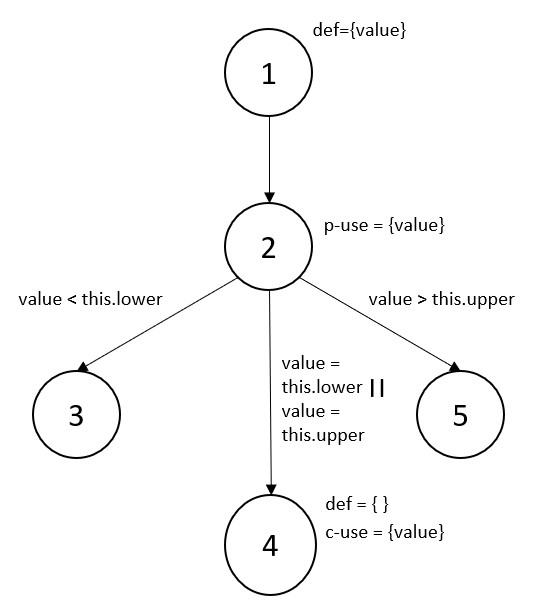
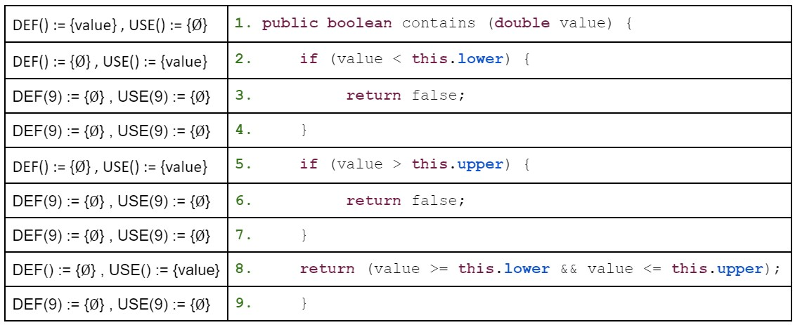
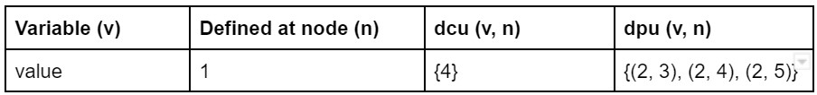
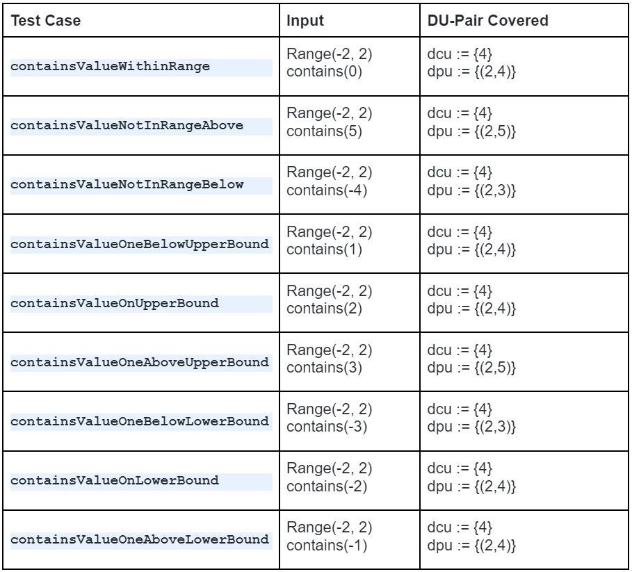
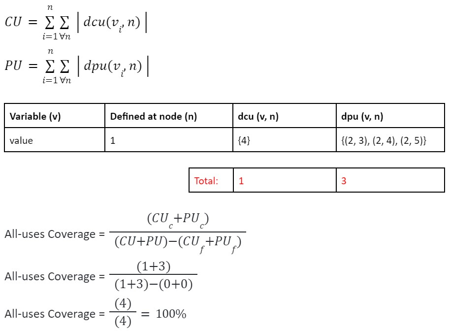

**SENG 438 - Software Testing, Reliability, and Quality**

**Lab. Report #3 – Code Coverage, Adequacy Criteria and Test Case Correlation**

| Group 08:      |
| -------------- |
| Jessica Hoang  |
| Daniel Le      |
| Ayal Mashiack  |
| Ayodeji Osho   |

**Table of Contents**

1. Introduction

2. Manual data-flow coverage calculations for 'calculateColumnTotal' and 'Intersects' methods

3. A detailed description of the testing strategy for the new unit test

4. A high level description of five selected test cases you have designed using coverage information, and how they have increased code coverage

5. A detailed report of the coverage achieved of each class and method (a screen shot from the code cover results in green and red color would suffice)

6. Pros and Cons of coverage tools used and Metrics you report

7. A comparison on the advantages and disadvantages of requirements-based test generation and coverage-based test generation.

8. A discussion on how the team work/effort was divided and managed

9. Any difficulties encountered, challenges overcome, and lessons learned from performing the lab

10. Comments/feedback on the lab itself

# 1 Introduction

The goal of this assignment is to use JUnit to create an automated unit testing suite that focuses on white-box testing and to use the coverage of the code to determine adequacy of the test suite. White-box testing is a technique that allows us to look at the software's internal structure, design and code to create test cases that verify input-output flow and requirements while meeting criterias that are mentioned later in the report. White-box testing includes control-flow coverage criterias, such as statement coverage, decision coverage, condition coverage and path coverage, and includes data-flow coverage criteria, such as DU pairs coverage. 

Our testing suite includes unit testing for the classes, _org.jfree.data.Range_ and _org.jfree.data.DataUtilities_. In each test class we utilized the test cases that we created for the previous assignment and added additional test cases for all other methods in each class to increase the criteria coverages. Additionally, we used EclEmma as a code coverage testing tool to keep track of the percentages of branch coverage, method coverage, and statement coverage we had for each test class.   

# 2 Manual data-flow coverage calculations for X and Y methods

## **Method X:** _org.jfree.data.DataUtilities calculateColumnTotal _

INSERT TEXT HERE... 

## **Method Y:** _org.jfree.data.Range contains_

### **Data Flow Graph**

### **Def-Use Set per Statement**

### **Def-Use Pair per Variable**

### **For each test case show which pairs are covered**

### **DU-Pair Coverage Calculation**

# 3 A detailed description of the testing strategy for the new unit test

Text…

# 4 A high level description of five selected test cases you have designed using coverage information, and how they have increased code coverage

Text…

# 5 A detailed report of the coverage achieved of each class and method (a screen shot from the code cover results in green and red color would suffice)

## _org.jfree.data.DataUtilities_

INSERT IMAGES HERE... 

### Statement Coverage

### Branch Coverage

### Method Coverage

## _org.jfree.data.Range_

INSERT IMAGES HERE...

### Statement Coverage

### Branch Coverage

### Method Coverage

# 6 Pros and Cons of coverage tools used and Metrics you report

## EclEmma
- very easy to use
- already set up in Eclipse
- clearly shows which lines/branches are being covered and what are not 
- does not show conditional coverage 

# 7 A comparison on the advantages and disadvantages of requirements-based test generation and coverage-based test generation.

Text…

# 8 A discussion on how the team work/effort was divided and managed

As done in the last assignment our team split the group into pairs of two. The two members who originally worked on _org.jfree.data.DataUtilities_ continued to test the methods in this class and the other two members who originally worked on _org.jfree.data.Range_ created additional test cases for this class. 

Everyone within the group imported the project and the test cases that we created from the previous assignment. Each person ran their JUnit test case with EclEmma and ensured that the methods that they responsible for in the previous assignment reached 100% coverage for statement, branch, and method coverage. Then in each pair of two, we split the remaining methods within each class. Once each member has completed creating additional test cases for the new methods assigned, we combined the test cases into two files, RangeTest.java and DataUtilities.java. In addition, each member reviewed all the test cases and suggested any additional changes before finalizing.  

Furthermore, we used Discord and Google Doc to organize our test plans, keep each other updated with the our personal progress, and to help each other out when trying new coverage tools.  

# 9 Any difficulties encountered, challenges overcome, and lessons learned from performing the lab

One difficulty encountered was finding a proper code coverage tool plugin for conditional coverage. The team used EclEmma for more of the coverage testing; however, this tool only has statistics for statement and branch coverage. We first tried to use CodeCover, which we were able to import and enable into Eclipse; but, when we tried to run the JUnit test case with CodeCover it gave an error saying _"Plug-in “org.codecover.eclipse” was unable to instantiate class “org.codecover.eclipse.junit.JUnitLaunchConfigurationDelegate.”_ From research online, it was stated that this issue could be resolved by using Eclipse Kepler; therefore, we downloaded Eclipse Kepler and tried to run our test cases, but another issue appeared. We tried to start from the very beginning and create a new java project; however, in Eclipse Kepler, the java version did not include java 1.8. 

We also looked into Cobertura and upon research we found that Cobertura is no longer supported within Eclipse. We also tried JaCoCo, Clover, and Coverlipse; however, none of them reported conditional coverage. Therefore, since we were unable to find any coverage tool available to suport the conditional coverage metric, we decided to replace the missing measure with method coverage instead. 

# 10 Comments/feedback on the lab itself

Text…
