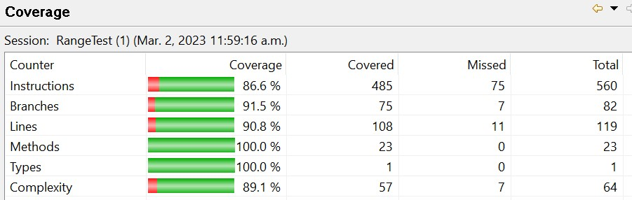
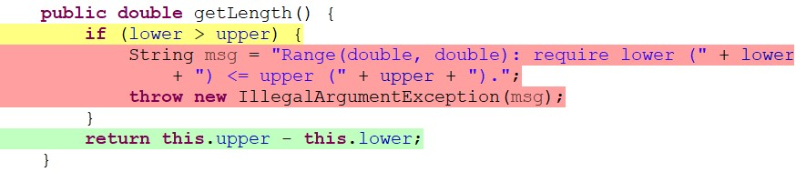
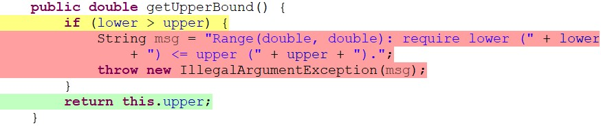
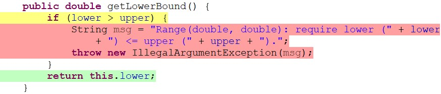
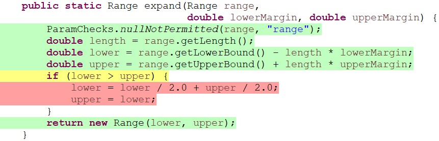

**SENG 438 - Software Testing, Reliability, and Quality**

**Lab. Report #3 – Code Coverage, Adequacy Criteria and Test Case Correlation**

| Group 08:      |
| -------------- |
| Jessica Hoang  |
| Daniel Le      |
| Ayal Mashiack  |
| Ayodeji Osho   |

**Table of Contents**

1. Introduction

2. Manual data-flow coverage calculations for 'calculateColumnTotal' and 'Intersects' methods

3. A detailed description of the testing strategy for the new unit test

4. A high level description of five selected test cases you have designed using coverage information, and how they have increased code coverage

5. A detailed report of the coverage achieved of each class and method (a screen shot from the code cover results in green and red color would suffice)

6. Pros and Cons of coverage tools used and Metrics you report

7. A comparison on the advantages and disadvantages of requirements-based test generation and coverage-based test generation.

8. A discussion on how the team work/effort was divided and managed

9. Any difficulties encountered, challenges overcome, and lessons learned from performing the lab

10. Comments/feedback on the lab itself

# 1 Introduction

The goal of this assignment is to use JUnit to create an automated unit testing suite that focuses on white-box testing and to use the coverage of the code to determine adequacy of the test suite. White-box testing is a technique that allows us to look at the software's internal structure, design and code to create test cases that verify input-output flow and requirements while meeting criterias that are mentioned later in the report. White-box testing includes control-flow coverage criterias, such as statement coverage, decision coverage, condition coverage and path coverage, and includes data-flow coverage criteria, such as DU pairs coverage. 

Our testing suite includes unit testing for the classes, _org.jfree.data.Range_ and _org.jfree.data.DataUtilities_. In each test class we utilized the test cases that we created for the previous assignment and added additional test cases for all other methods in each class to increase the criteria coverages. Additionally, we used EclEmma as a code coverage testing tool to keep track of the percentages of branch coverage, method coverage, and statement coverage we had for each test class.   

# 2 Manual data-flow coverage calculations for X and Y methods

## **Method X:** _org.jfree.data.DataUtilities calculateColumnTotal _

Link to pictures containing manual data-flow coverage calculations
https://github.com/Shie1ded/seng438_g8/tree/main/A3/ManualTesting/DataUtilities-calculateColumnTotal

## **Method Y:** _org.jfree.data.Range contains_

Link to pictures containing manual data-flow coverage calculations
https://github.com/Shie1ded/seng438_g8/tree/main/A3/ManualTesting/Range-Contains

# 3 A detailed description of the testing strategy for the new unit test

The goal of our testing strategy is to get as much statement, branch, and method coverage as possible. 

**Statement Coverage:** statement coverage is a white-box testing technique whose goal is simply to ensure that the test cases are being executed (that the code inside the test cases runs, whether it fails or not). In order to increase the statement coverage we needed to make sure that a case is created for each boundary value or modify the existing test cases so that all their initial requirements are met. 

**Branch Coverage:** branch coverage relates to decisions in a program, and more specifically, to make sure that each edge of the Control Flow Graph’s decisions is traversed at least once. In order to increase Branch coverage we must make sure that if there is a decision to be made by the program (if, else for example) the program will exercise all decisions that traverse the control flow of the program.

**Method Coverage:** Method coverage is a metric that checks to see if a method has been called at least once during an execution. To increase this coverage, we ensured that we either had a test case specifically for the method being tested, or that it had been implicitly called by another method. 

**What we did for each test case**

1. We created test cases based on specifications (i.e a non-empty array), requirements (for example, taking in an array of doubles), and limitations (such as only handling numbers) of the method, making sure to include any predefined boundary (like values are >0) as well.
2. Then we ran the test cases with EclEmma coverage
3. Then we checked to see which section of the method has been partially tested (highlighted in yellow), meaning there is another part of the condition not being tested (example, if with no else), or not been tested at all (highlighted in red).
4. Lastly, for missing branch coverage, we understand which specification, requirements, or boundary has not been checked/tested, and create additional test cases for that case.

# 4 A high level description of five selected test cases you have designed using coverage information, and how they have increased code coverage

## DataUtilities

Text.. TO ADD

## Range

### @Test - combineFirstNULLIsNaN()

This test case is to test the method _combineIgnoringNaN_, where there are two parameters of type Range. The method will combine both specified Range to create a new Range while ignoring any Double.NaN values. In this test case, the first Range input is a null object, and the second input is a Range that has a lower bound of Double.NaN and an upper bound of Double.NaN. The expected result should be null. 

This increased the code coverage as it followed the control flow of one of the branches within the method. Specifically, it followed the first branch condition where the condition evaluates to true since the first range is null, and then it follows the true condition of the inner if statement as the second Range is not a null object and has both a lower and upper bound of Double.NaN. Therefore, increasing branch coverage by 3 covered branches and increasing instruction coverage by 9 covered instructions. 

### @Test - expand50PercentBOTH

This test case is to test the method _expand_, where the parameters include a Range that cannot be null, and a lower margin and an upper margin that are expressed as a percentage of the range length. This method returns the new Range that has been calculated by adding the margin to the existing range boundaries. In this test case, the Range is (5, 20), and both the lower and upper margin are 50% (0.5). The expected result should be a Range of (-2.5, 27.5).

This test case increased the code coverage as it follows the correct control flow; therefore, the majority of the instruction in the method is executed. The method coverage is increased by 4 covered branches and the instruction coverage is increased by 60 covered instructions as the second instruction in the method calls the getLength method, the third instruction calls the getLowerBound method, and the fourth instruction calls the getUpperBound method, which all correctly returns the length as the Range has legal arguments. Once all the calculations of the expand method are complete, the new Range is returned. 

### @Test - scaleNegativeInput

This test case is to test the method _scale_, where the parameters is a type Range that cannot be  null and a type double called factor that cannot be a negative value. The method should return a new range that has been scaled by the specified factor. In this test case, the range is (5, 20), and the factor is -2, which is an illegal argument. The expected result should return the class,  IllegalArgumentException. 

This test case increased the code coverage as it follows a branch within the method scale, where the factor is less than 0 and then appropriately throws a new IllegalArgumentException.
Therefore, increasing branch coverage by 1 covered branches and increasing instruction coverage by 12 covered instructions. 

# 5 A detailed report of the coverage achieved of each class and method (a screen shot from the code cover results in green and red color would suffice)

## _org.jfree.data.DataUtilities_

INSERT IMAGES HERE... 

### Statement Coverage

### Branch Coverage

### Method Coverage

## _org.jfree.data.Range_

We achieved a statement coverages of 86.6% but could not exceed that for the following reasons:

Additionally, in org.jfree.data.Range, the methods getLength, getUpperBound, and getLowerBound, and expand, all have blocks of code that also cannot be reached as shown in the images below. The reason why the code cannot be reached is because it checks to see if the lower bound is less than the upper bound; however, in the Range constructor, it already checks for cases in which the lower bound is less than the upper bound and returns with an illegal argument exception accordingly. Therefore, there is no way for a Range to have a lower bound that is less than the upper bound, which means that the branch that checks for this in each of the methods above will never be executed. 

Another method that we had trouble getting 100% coverage for is contains. The reason why we could not get 100% coverage is because the final return condition can only evaluate to true, as the value to evaluate it to false is already caught with the first two if conditions. Although we have 100% coverage for the other methods, since we are unable to increase the coverage for these 4 methods, the highest statement coverage that we could report is 86.6% for the Range class. 

# 6 Pros and Cons of coverage tools used and Metrics you report

## Coverage Tools 

To start off, we used EclEmma as our coverage tool to report the desired metrics of statement coverage, branch coverage, and conditional coverage. The pros of EclEmma is that it was user friendly and easy for the team to use as we have all used this tool in previous courses and since it is built into Eclipse, the set up was seamless. Another advantage of this coverage tool is that it clearly showed which lines and branches have already been covered by the test cases that we created by using colors, such as green, yellow, and red. These colors made it easy for us to create additional test cases to increase our coverage to the desired levels. However, a con of this coverage tool is that it did not report conditional coverage, which was a problem as this was a metric that we were interested in. 

As mentioned in the last paragraph, since EclEmma did not report conditional coverage, we tried other coverage tools. We looked into JaCoCo, Clover, and Coverlipse, and although they were all easy to set up and integrate with Eclipse, they had the same disadvantage as EclEmma in that it also only reported statement coverage and branch coverage. We also looked into Cobertura and upon research we found that Cobertura is no longer supported within Eclipse. 

Another coverage tool we tried was CodeCover. A pro of CodeCover was that it was quite simple to import and enable into Eclipse. However, a con was that when we tried to run the JUnit test case with CodeCover it gave an error saying "Plug-in “org.codecover.eclipse” was unable to instantiate class “org.codecover.eclipse.junit.JUnitLaunchConfigurationDelegate.” From research online, it was stated that this issue could be resolved by using Eclipse Kepler; therefore, we downloaded Eclipse Kepler and tried to run our test cases, but another issue appeared. We then learned that Eclipse Kepler did not support Java 1.8, which would be infeasible for our assignment as Java 1.8 was needed. 

Lastly, we tried SonarLint, iterating this plug-in with Eclipse was very easy as we only needed to search for the coverage tool in the Eclipse Marketplace. However, a disadvantage with this tool was how difficult it was to connect it to either SonarQube or SonarCloud to report the coverage metrics. To connect to SonarQube we needed to connect to the server and log in with our username and password; however, it was unclear what authentication was needed. Therefore, we were unable to continue using this coverage tool. 

## Metrics Reported 

First, we reported statement coverage. An advantage of this metric is that it allowed us to easily identify which instructions have not yet been executed or tested, with this, we were able to create additional test cases and increase our coverage. Another advantage is that it helped us verify the expectations of the code as we could easily see which instructions were being executed and which were not. However, a disadvantage is that it does not check any false conditions or logical conditions at all. 

The second metric reported is branch coverage. The pros of this metric is that it helps us ensure that no branch leads to any unusual behavior, such as executing when it shouldn’t. This metric also helped us determine if a branch can be reached within a method or not and whether that block of code is necessary to have in the program. A disadvantage of branch coverage is that it purely looks at when a condition is false or true; therefore, as the tester it is easy for us to miss test cases where there could be multiple ways to make the condition false. 

Lastly, we reported method coverage. The advantage of this is that it helps ensure that all methods within the class have been reviewed at least once. However, a disadvantage is that it only checks if the method has been executed within the test cases, it does not check the quality of the testing. 

# 7 A comparison on the advantages and disadvantages of requirements-based test generation and coverage-based test generation.

## Requirements-Based Testing

In requirements-based test generation, test cases are formed off the objectives and needs based on the requirements of the SUT. These may include tests for functional requirements such as any product features or functions that allow the system to perform as intended. They may also include non-functional requirements that help test the systems performance, reliability, and usability for end-users.

When it comes to requirements-based test generation many advantages can be noticed in comparison to other test generating methods. One major advantage is that tests are easier to find and plan as all tests generated are specifically targeting any requirements of the system, these requirements are likely listed and well-defined during the development of the SUT. This also allows for the testing phase to be done in a timely manner.

This method of test generation also comes with disadvantages, for instance requirements may be too brief and may not cover all aspects of the systems capabilities, thus causing important parts of the software especially in relation to quality to be missed or ignored.

## Coverage-Based Testing

Text.. TO ADD

# 8 A discussion on how the team work/effort was divided and managed

As done in the last assignment our team split the group into pairs of two. The two members who originally worked on _org.jfree.data.DataUtilities_ continued to test the methods in this class and the other two members who originally worked on _org.jfree.data.Range_ created additional test cases for this class. 

Everyone within the group imported the project and the test cases that we created from the previous assignment. Each person ran their JUnit test case with EclEmma and ensured that the methods that they responsible for in the previous assignment reached 100% coverage for statement, branch, and method coverage. Then in each pair of two, we split the remaining methods within each class. Once each member has completed creating additional test cases for the new methods assigned, we combined the test cases into two files, RangeTest.java and DataUtilities.java. In addition, each member reviewed all the test cases and suggested any additional changes before finalizing.  

Furthermore, we used Discord and Google Doc to organize our test plans, keep each other updated with the our personal progress, and to help each other out when trying new coverage tools.  

# 9 Any difficulties encountered, challenges overcome, and lessons learned from performing the lab

As mentioned above, one difficult encounter was finding a proper code coverage tool for conditional coverage as many of the ones that we tried only reported statement and branch coverage. Therefore, to overcome this challenge, we had to replace the missing measure with method coverage instead. 

Another difficulty that we encountered that was mentioned above in our detailed report of our coverage, was increasing our statement coverage percentage. We could not increase statement coverage as in org.jfree.data.DataUtilities, the method calculateColumnTotal, has a block of code that cannot be reached. Additionally, in org.jfree.data.Range, the methods getLength, getUpperBound, and getLowerBound, contains, and expand, all have blocks of code that also cannot be reached either as the conditions to reach the block of code has already been checked elsewhere before these statements are executed. 

# 10 Comments/feedback on the lab itself

Text…
